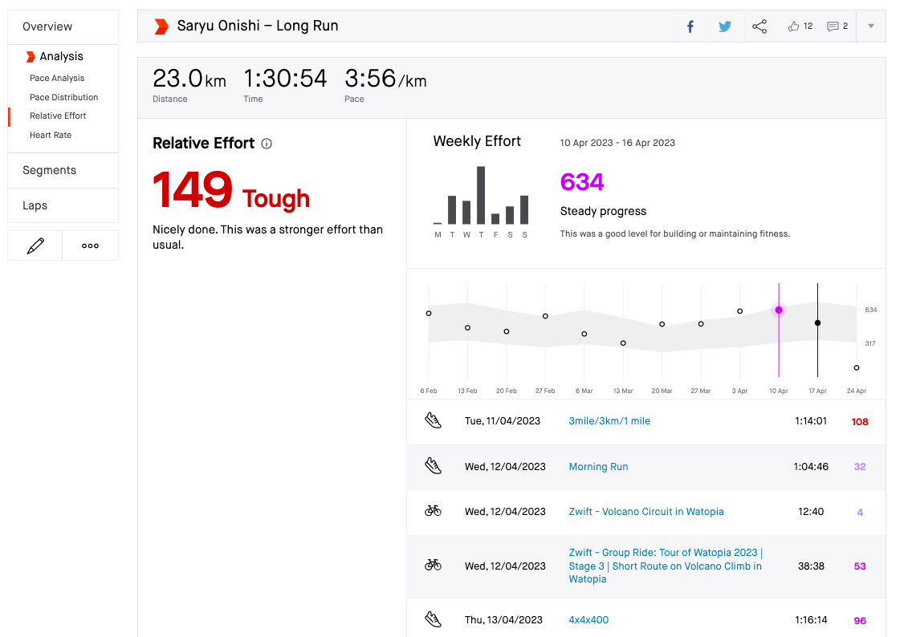
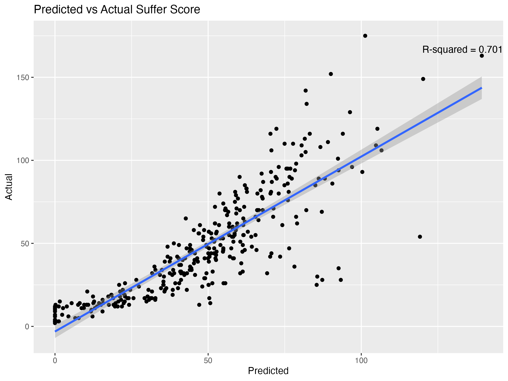
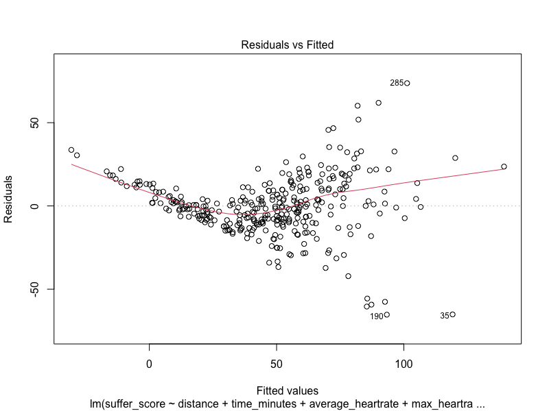

```{r setup, include=FALSE}
knitr::opts_chunk$set(echo = FALSE)
library(tidyverse)
library(modelsummary)
library(psych)
```
class: title-slide   
<br><br>
# Exploring Strava's Suffer Score
## ECON 5252 Final Project
### Saryu Onishi 

---
# Introduction to Strava and Suffer Score
.pull-left[
## Dashboard
- Share activities
- Interact with fellow uploaders

]
.pull-right[
## Analysis
- Summary of activity
- In-depth analysis

]

???
indepth analysis:
- pace analysis
- hr analysis
- relative effort
---
# Suffer Score / Relative Effort / Training Load
.pull-left[
<!--.center[]-->

]
.pull-right[
Measure of training load
- Training impulse (Banister et al.)
Dose response relationship

### Goal: 
- Analyze the relationship between summary statistics and the suffer score
]
???
suffer score:
- measure that helps get an idea "dose" of the activity, in relation to the physiological "response"

assume we care about the "suffer score" metric. 

assume we want to know how various summary metrics impact suffer score

---

# Data
1. Scrape activity data from single user
2. Filter activities that meet the following criteria:
 - Activity type = Run
 - Has heart rate data
 - Accessible data
3. Mutate time variable (seconds -> minutes)
 
<small>
```{r}
run <- read.csv("StravaData.csv") %>% as.data.frame() 
options(width = 120)
head(run)
```
</small>
???
why only my profile:
- physiological responses vary
- authentication
---

# Methods
Multiple linear regression
$$Y = \beta_0 + \beta_1 X_1 + \beta_2 X_2 + ... + \beta_n X_n + \epsilon$$
- Backwards Stepwise regression

```{r, include=FALSE}
run_mod <- run %>% select(-c("name","id","start_date"))
initial <- lm(suffer_score ~ ., data=run_mod)
mod     <- list()
back    <- mod[['backwards']] <- step(initial, direction='backward')
# var     <- colnames(run_mod)
```
.center[
```{r, include=TRUE}
# var_df <- var %>% 
#   as.data.frame() %>% 
#   mutate(IndependentVariables = var) %>% 
#   select(IndependentVariables) %>% 
#   filter(IndependentVariables != 'suffer_score')

data_sum <- run_mod %>% 
  describe() %>% 
  select(c("n","mean","sd","min","max")) %>% 
  print()
```
]
---
# Findings
<!--.center[]-->
$Y = -217 + 7.06distance -0.55time + 1.28hr_{ave} + 0.16hr_{max} + \epsilon$


```{r}
mod_df <- 
  summary(back)$coefficients %>% 
  as.data.frame %>% 
  select(-"t value") %>% 
  print()

```

---
# Findings
## Performance
.pull-left[

]
.pull-right[

]
---
# Concluding Remarks
1. Insights from the model
 - Important variables
 - Limitations of summary metrics to capture training load
2. Limitations
 - Method of variable selection
 - Interaction between variables
 - hetertoscedastic data
 - possible non-linear relationships

???
2. limitation
  - linear relationships assumed
  - 
 
 